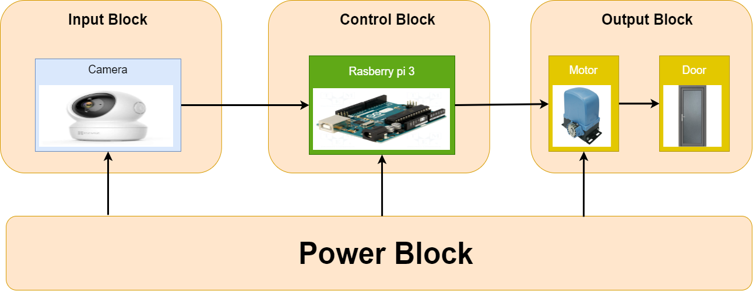

# Embeded-System-Security-Door-15
This is source code Embeded System project. Name project is Security Door by Group 15 - Ha Noi University of Science and Technology.  
## Introduction  

This source code is run face recognition and is implentmented by Rasberri Pi 3.  
System: Security Door.  

<div align='center'>
    
</div>  


## Implement   
Step 1: Setup System.  
Step 2: Install Library  
```
pip install -U -r requirements.txt  
```
Step 3: At the Terminal  
```
python detect_face.py
```
